# Descripción y análisis de los datos para Text-to-SQL

Se utilizarán **Spider 1.0** y **BIRD-SQL** para estudiar la generación de consultas SQL a partir de preguntas en lenguaje natural y del esquema de una base de datos. Ambos conjuntos contienen preguntas en inglés, consultas SQL de referencia e identificadores de las bases sobre las que deben ejecutarse. BIRD incorpora, además, una anotación de conocimiento auxiliar denominada *evidence*.

El análisis distingue dos unidades de observación: el *ejemplo*, formado por una pregunta y su SQL, y el *esquema*, que describe las tablas, columnas y relaciones de una base. Una misma base puede estar asociada con numerosas preguntas. Por tanto, el número de ejemplos y el número de bases son cantidades diferentes. El corpus del estudio comprende las particiones públicas de entrenamiento y desarrollo de Spider 1.0 y BIRD-SQL. Las estadísticas describen estas particiones; los conjuntos de prueba oficiales con anotaciones no públicas quedan fuera del alcance del análisis.

### Spider 1.0

Spider fue presentado por Yu et al. como un benchmark multidominio para estudiar la generalización a consultas y esquemas diferentes de los observados durante el entrenamiento. Las anotaciones se cargaron desde [`xlangai/spider`](https://huggingface.co/datasets/xlangai/spider), cuya licencia declarada es **CC BY-SA 4.0**. Los esquemas se obtuvieron del archivo `evaluation_examples/examples/tables.json` del repositorio oficial `taoyds/spider`, enlazándolos con los ejemplos mediante `db_id`.

La versión analizada contiene **7 000 ejemplos de entrenamiento** y **1 034 de validación**, para un total de **8 034 ejemplos en 160 bases**. Cada anotación tiene seis campos originales; al añadir `split`, la tabla combinada inicial tiene dimensiones $8\,034\times7$. Los ejemplos de entrenamiento pertenecen a 140 bases y los de validación a otras 20, sin intersección de identificadores entre ambas particiones. El archivo de metadatos cargado contiene 166 esquemas, pero las estadísticas estructurales se calculan únicamente sobre los 160 vinculados con los ejemplos analizados.

### BIRD-SQL 

BIRD fue presentado por Li et al. como un benchmark que incorpora consultas sobre bases de datos de distintos dominios y conocimiento auxiliar para su interpretación. Se utilizan los archivos `train.json`, `dev.json`, `train_tables.json` y `dev_tables.json` distribuidos en el repositorio comunitario [`Deema/BIRD-SQL`](https://huggingface.co/datasets/Deema/BIRD-SQL). Se identifica este repositorio como fuente de descarga, mientras que la fuente oficial del benchmark es el proyecto BIRD, que declara la licencia **CC BY-SA 4.0**.

El análisis utiliza el **entrenamiento original completo de 9 428 ejemplos**, junto con los **1 534 ejemplos del desarrollo público**, para un total de **10 962 ejemplos en 80 bases**. El entrenamiento original contiene 69 bases y desarrollo contiene 11. Los registros originales de entrenamiento tienen cuatro campos y los de desarrollo seis; estos últimos incluyen también `question_id` y `difficulty`. Al unir ambas fuentes y añadir `source_split` y `split`, se obtiene una tabla inicial de $10\,962\times8$, antes de incorporar métricas derivadas. Las estadísticas corresponden a la versión original de las anotaciones distribuida en la fuente indicada.

Para disponer de una prueba interna, se reservaron bases completas del entrenamiento original mediante una selección reproducible con semilla 42. El número de bases reservadas se calculó como $\lceil0{,}20\times69\rceil=14$. Así, quedaron **7 996 ejemplos de 55 bases para entrenamiento** y **1 432 ejemplos de 14 bases para prueba interna**. Los 1 534 ejemplos de las 11 bases de desarrollo se conservaron como validación. La reserva se hizo sobre bases, no sobre filas; por ello, el porcentaje de preguntas reservadas no tiene que coincidir con el 20 %. Esta prueba interna es una partición experimental propia y no equivale al test oficial oculto de BIRD.

**Tabla 1.** Dimensiones de las particiones. Las bases son identificadores distintos de esquemas, mientras que los ejemplos son pares pregunta–SQL. No se comparten bases entre particiones de un mismo conjunto.

| Conjunto | Partición utilizada | Ejemplos | Bases |
| --- | --- | --- | --- |
| Spider | Entrenamiento | 7 000 | 140 |
| Spider | Validación | 1 034 | 20 |
| **Spider** | **Total analizado** | **8 034** | **160** |
| BIRD | Entrenamiento tras la reserva | 7 996 | 55 |
| BIRD | Validación: desarrollo público | 1 534 | 11 |
| BIRD | Prueba interna | 1 432 | 14 |
| **BIRD** | **Total analizado** | **10 962** | **80** |

## Estructura, variables y formatos

Los ejemplos se organizan en tablas de anotaciones, mientras que los esquemas se conservan como registros JSON asociados mediante `db_id`. Las métricas del esquema se incorporan a cada ejemplo para facilitar el análisis, pero las estadísticas estructurales se calculan sobre una tabla independiente con una fila por base. Esto evita que una base con muchas preguntas tenga más peso en el análisis de esquemas.

**Tabla 2.** Variables de las anotaciones. Los tipos describen el contenido lógico; las secuencias se almacenan como listas o arreglos según la representación utilizada al cargar los datos.

| Variable | Tipo y formato | Significado y disponibilidad |
| --- | --- | --- |
| `db_id` | Cadena de texto | Identificador de la base objetivo; permite recuperar su esquema. Presente en ambos conjuntos. |
| `question` | Cadena de texto | Pregunta original en inglés. Presente en ambos conjuntos. |
| `query` / `SQL` | Cadena de texto SQL | Consulta de referencia: se denomina `query` en Spider y `SQL` en BIRD. |
| `question_toks` | Secuencia de cadenas | Pregunta tokenizada en Spider. |
| `query_toks` | Secuencia de cadenas | SQL tokenizado en Spider. |
| `query_toks_no_value` | Secuencia de cadenas | SQL de Spider tokenizado, con valores literales sustituidos por el marcador `value`. |
| `evidence` | Texto, posiblemente vacío | Información auxiliar anotada en BIRD para interpretar conceptos, códigos, columnas o cálculos de la pregunta. |
| `question_id` | Identificador entero | Campo disponible en el desarrollo de BIRD. Al combinarlo con entrenamiento aparecen valores ausentes y puede representarse numéricamente como decimal en pandas. |
| `difficulty` | Categoría textual | Dificultad anotada en el desarrollo de BIRD: `simple`, `moderate` o `challenging`. No está disponible en el entrenamiento cargado. |
| `split` | Categoría textual añadida | Partición experimental: `train`, `validation` y, en BIRD, `test_interno`. |
| `source_split` | Categoría textual añadida | Procedencia original de BIRD: `train_original` o `dev_oficial`. |

**Tabla 3.** Metadatos de esquema asociados a cada base de datos. Los índices de claves remiten a la lista de columnas del esquema.

| Variable de esquema | Tipo y formato | Significado |
| --- | --- | --- |
| `table_names`, `table_names_original` | Listas de cadenas | Nombres normalizados y originales de las tablas. |
| `column_names`, `column_names_original` | Listas de pares | Cada par contiene el índice de la tabla y el nombre de la columna. El índice de tabla $-1$ identifica el comodín `*`, excluido de los conteos de columnas reales. |
| `column_types` | Lista de cadenas | Tipo declarado para cada columna; su posición corresponde a la de la lista de columnas. |
| `primary_keys` | Lista de índices o grupos de índices | Columnas que integran claves primarias (PK). En BIRD se consideran también las claves compuestas. |
| `foreign_keys` | Lista de pares de índices | Cada par vincula una columna de origen con una columna referenciada mediante una clave foránea (FK). |

Se derivan las longitudes de preguntas y SQL en caracteres y en unidades separadas por espacios; BIRD incorpora también la longitud de `evidence`. Esta última segmentación aproxima la extensión del texto y no corresponde a los tokens de un modelo de lenguaje. Para los esquemas se calculan los números de tablas, columnas, columnas PK y relaciones FK, así como los porcentajes de tablas y columnas que participan en las claves. En BIRD, una PK compuesta aporta tantas columnas como componentes tenga, sin confundir este conteo con el número de restricciones de clave primaria.

## Analítica descriptiva de las anotaciones

### Completitud y diversidad de preguntas y consultas

En Spider no se observaron valores nulos en los campos originales ni en `split`. En BIRD tampoco se observaron nulos en `db_id`, `question`, `evidence` y `SQL`. Sin embargo, **793 ejemplos contienen evidencia vacía**. Además, `question_id` y `difficulty` están ausentes en las 9 428 filas procedentes del entrenamiento original, ya que esos campos solo se incluyen en desarrollo; esta ausencia se debe a la estructura de las fuentes.

**Tabla 4.** Cardinalidad textual de los conjuntos completos analizados. Las comparaciones son literales y se realizan entre todas las particiones de cada conjunto.

| Medida | Spider | BIRD |
| --- | --- | --- |
| Ejemplos analizados | 8 034 | 10 962 |
| Textos distintos de pregunta | 7 990 | 10 949 |
| Textos distintos de SQL | 4 525 | 10 842 |

Una pregunta se considera única cuando su texto es distinto de los demás, sin incorporar `db_id` a la comparación. Por ello, una pregunta idéntica asociada a bases diferentes se cuenta una sola vez. De forma análoga, el conteo de SQL únicos compara cadenas, no equivalencia semántica. En Spider, la diferencia entre 7 990 preguntas únicas y 4 525 consultas únicas muestra que distintas formulaciones pueden compartir el mismo texto SQL. También puede repetirse una consulta textual en bases diferentes. Estas repeticiones de campos no demuestran por sí solas que existan registros completos duplicados. En BIRD se obtienen 10 958 combinaciones distintas de base, pregunta y SQL, frente a 10 962 filas; la coincidencia de esa combinación tampoco exige que la evidencia sea idéntica.

### Frecuencias por base y construcciones SQL

La Figura [1](#fig-datos-dominios) muestra que la cantidad de ejemplos por base es desigual. En BIRD, las bases más frecuentes del conjunto público cargado son `works_cycles`, con 474 ejemplos; `public_review_platform`, con 381; y `retail_world`, con 373. Este desequilibrio debe considerarse al interpretar métricas agregadas, ya que las bases con más preguntas contribuyen más al resultado global por ejemplo.

**Figura 1.** Veinte bases con mayor número de ejemplos en cada conjunto.

*Spider.*

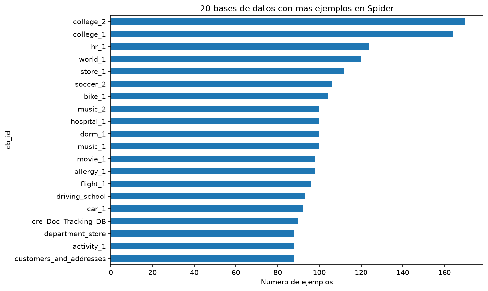

*BIRD: todas las particiones analizadas.*

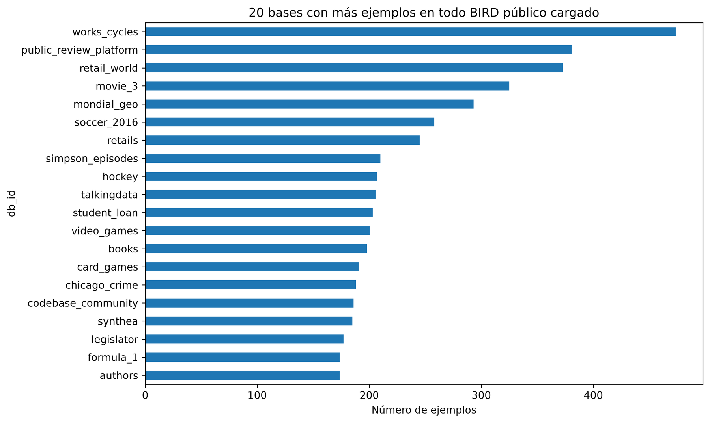

Las construcciones SQL se identificaron mediante expresiones regulares que detectan palabras y patrones como `JOIN`, `GROUP BY` y funciones de agregación. Una consulta puede pertenecer a varias categorías, por lo que las frecuencias no suman el total de ejemplos. La presencia de más de un `SELECT` se utiliza como aproximación de subconsulta; también puede detectar operaciones de conjuntos y no sustituye un análisis sintáctico completo.

**Tabla 5.** Frecuencias y porcentajes de algunas construcciones. Cada porcentaje usa como denominador todos los ejemplos del conjunto correspondiente.

| Construcción | Spider: Frecuencia | Spider: % | BIRD: Frecuencia | BIRD: % |
| --- | --- | --- | --- | --- |
| `JOIN` | 3 179 | 39,57 | 8 352 | 76,19 |
| Agregación | 3 821 | 47,56 | 5 157 | 47,04 |
| `GROUP BY` | 2 052 | 25,54 | 1 129 | 10,30 |
| `ORDER BY` | 1 865 | 23,21 | 2 027 | 18,49 |
| Más de un `SELECT` | 1 178 | 14,66 | 862 | 7,86 |

La mayor proporción de `JOIN` en BIRD indica que la combinación explícita de tablas es más frecuente en las consultas analizadas. En cambio, Spider presenta una mayor proporción de `GROUP BY` y de consultas con más de un `SELECT`. Por tanto, las diferencias describen perfiles de consulta distintos y no permiten ordenar ambos conjuntos mediante una única medida de dificultad. La Figura [2](#fig-datos-sql) muestra el resto de las categorías detectadas.

**Figura 2.** Frecuencias absolutas de construcciones SQL. Las categorías no son excluyentes.

*Spider.*

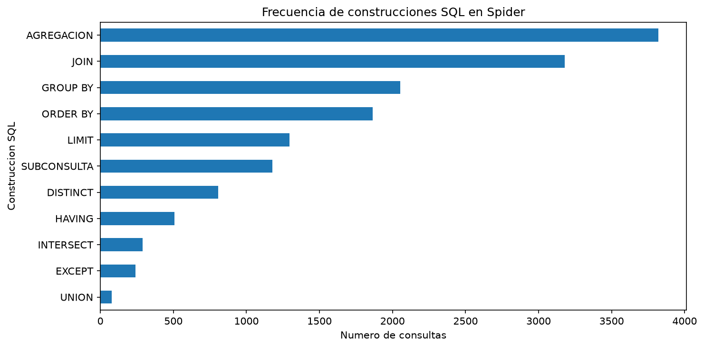

*BIRD.*

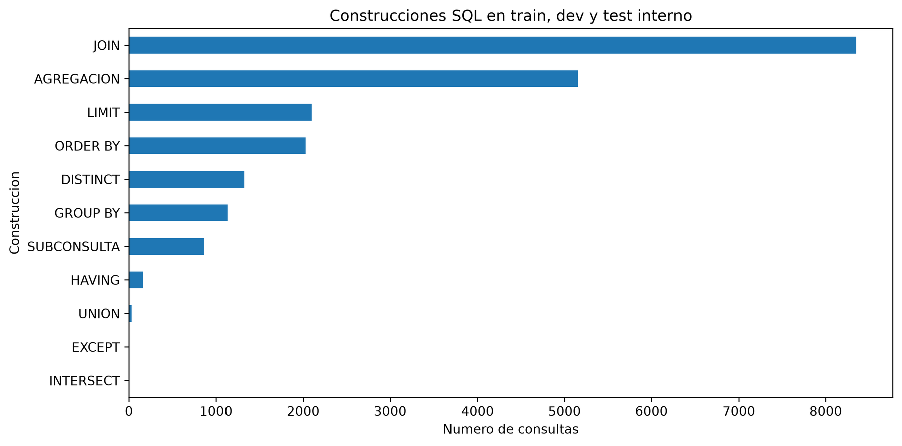

### Longitud de preguntas y SQL

**Tabla 6.** Extensión de preguntas y consultas SQL. El conteo por espacios es una aproximación textual, no la tokenización de un modelo.

| Medida por separación de espacios | Spider: Media | Spider: Mediana | BIRD: Media | BIRD: Mediana |
| --- | --- | --- | --- | --- |
| Longitud de pregunta | 12,69 | 12 | 14,12 | 13 |
| Longitud de SQL | 15,85 | 13 | 25,75 | 24 |

Los histogramas de las Figuras [3](#fig-datos-longitudes-pregunta) y [4](#fig-datos-longitudes-sql) muestran variabilidad en ambos conjuntos. BIRD presenta consultas más extensas en promedio: 25,75 unidades frente a 15,85 en Spider. Las longitudes máximas de SQL son 178 y 87, respectivamente, mientras que las preguntas alcanzan máximos de 59 y 39. Estas diferencias son relevantes para estimar la extensión de las salidas que debe generar el modelo, aunque la longitud no determina por sí sola la dificultad semántica.

**Figura 3.** Histogramas de longitud de las preguntas. Los ejes y las frecuencias corresponden a cada conjunto, cuyos tamaños son diferentes.

*Spider.*

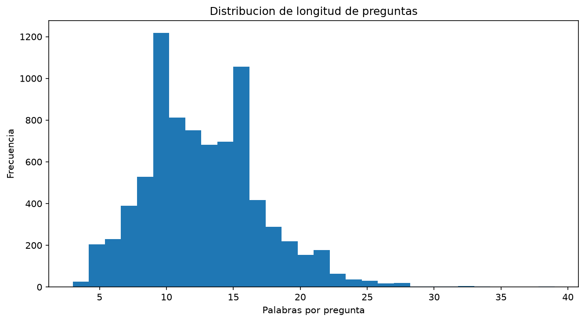

*BIRD.*

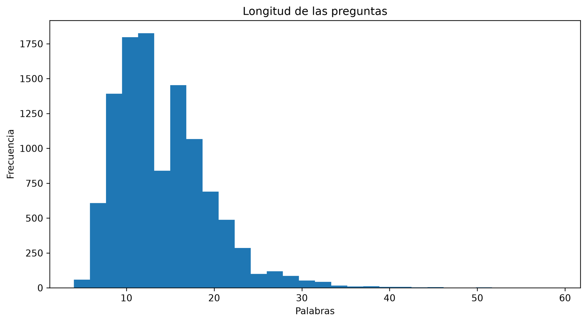

**Figura 4.** Histogramas de longitud de las consultas SQL.

*Spider.*

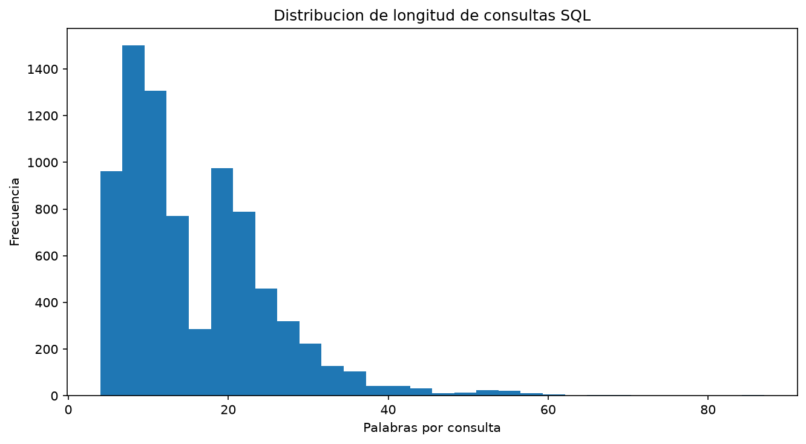

*BIRD.*

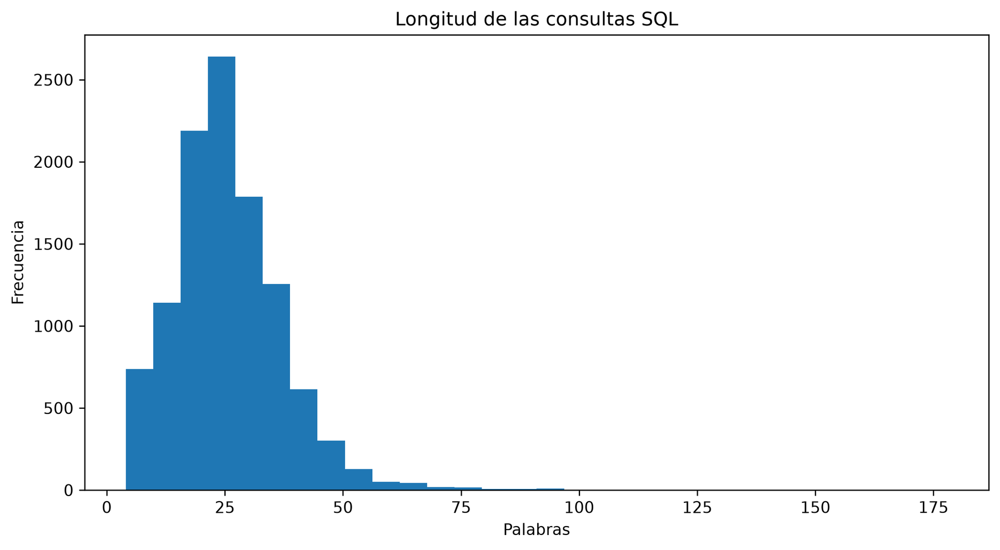

### Evidencia auxiliar de BIRD

El campo `evidence` contiene texto no vacío en **10 169 ejemplos**, equivalentes al **92,77 %** del conjunto analizado. Su longitud media es de 14,57 unidades separadas por espacios y la mediana es 13, incluyendo los registros vacíos como longitud cero. La Figura [5](#fig-datos-evidence) muestra la distribución de su longitud.

La evidencia puede precisar información que no resulta evidente a partir de los nombres del esquema. En un ejemplo de `social_media`, la pregunta solicita contar los tuits en inglés y la evidencia aclara que ese idioma corresponde a `Lang = 'en'`. En otro ejemplo, de `cs_semester`, indica que `diff` representa la dificultad de un curso y que los valores mayores corresponden a cursos más difíciles. En `book_publishing_company`, orienta a sumar `qty` por fecha antes de identificar el mayor total. Estos casos ilustran correspondencias entre lenguaje natural, códigos almacenados y operaciones SQL. Para estudiar su utilidad se podrán comparar condiciones de generación con y sin evidencia, reportando explícitamente cuál se emplea.

**Figura 5.** Distribución de la longitud de la evidencia auxiliar en BIRD.

*Longitud de la evidencia.*

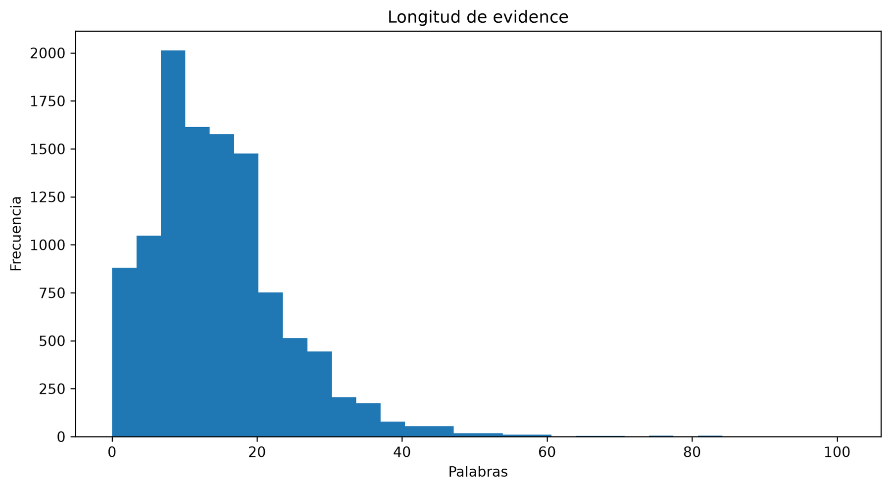

## Análisis descriptivo de los esquemas

### Tamaño y tipos de columnas

La Tabla [7](#tab-datos-esquemas) resume las propiedades de cada base. En este análisis, cada esquema se cuenta una sola vez. El número de columnas corresponde a la suma de columnas de todas sus tablas, excluyendo el comodín `*`. Si dos tablas poseen una columna denominada `id`, se cuentan ambas porque pertenecen a tablas diferentes.

**Tabla 7.** Estadísticas estructurales. Las columnas PK y las relaciones FK son medidas diferentes: una clave primaria puede incluir varias columnas y una misma tabla puede intervenir en varias relaciones FK.

| Medida por base | Spider | BIRD |
| --- | --- | --- |
| Bases analizadas | 160 | 80 |
| Media de tablas | 5,11 | 7,46 |
| Mediana de tablas | 4 | 5 |
| Rango de tablas | 2–26 | 2–65 |
| Media de columnas | 26,82 | 54,21 |
| Mediana de columnas | 19 | 38,5 |
| Rango de columnas | 6–352 | 6–455 |
| Media de columnas PK | 4,54 | 9,02 |
| Mediana de columnas PK | 3 | 6 |
| Media de relaciones FK | 4,64 | 6,58 |
| Mediana de relaciones FK | 3 | 4 |
| Máximo de relaciones FK | 25 | 61 |

Los esquemas de BIRD presentan más columnas por base tanto en media como en mediana. En Spider, `baseball_1` es el esquema con más columnas, con 352 distribuidas en 26 tablas. En BIRD, `works_cycles` contiene 455 columnas y 65 tablas. Los histogramas de la Figura [6](#fig-datos-tamano-esquemas) evidencian la presencia de esquemas extensos respecto de los valores centrales. Un mayor tamaño amplía el conjunto de tablas y columnas candidatas que debe considerar el modelo al interpretar una pregunta, sin implicar que todas se utilicen en una misma consulta.

**Figura 6.** Distribución del número de tablas y columnas por base: Spider arriba y BIRD abajo. Las columnas representan el total de cada esquema, no el número de registros de sus tablas.

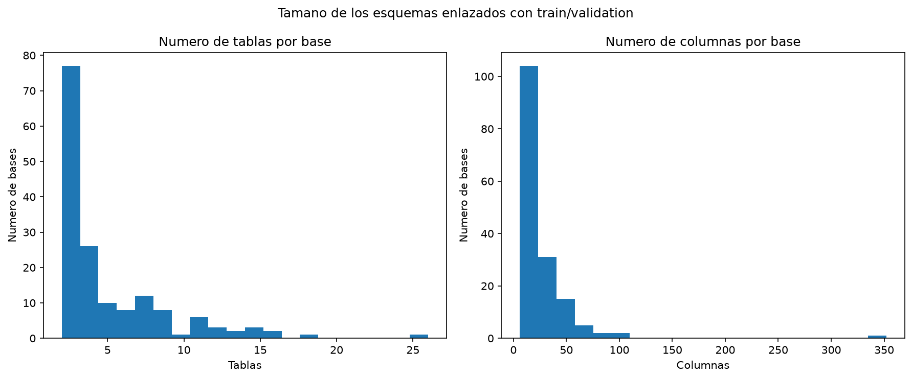

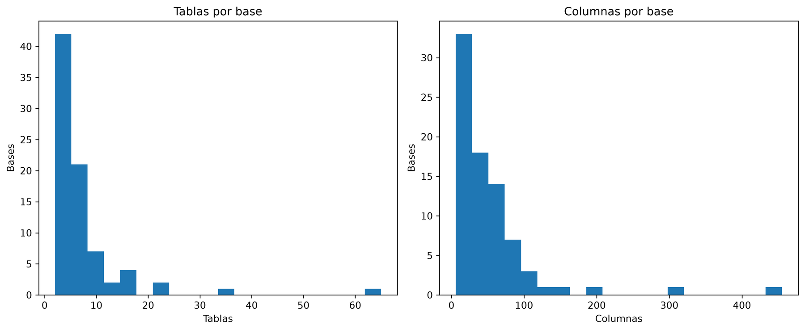

Spider contiene 4 291 columnas reales en los esquemas analizados: 2 063 de tipo `number`, 2 000 `text`, 215 `time`, 8 `others` y 5 `boolean`. BIRD contiene 4 337 columnas: 2 096 `text`, 1 633 `integer`, 377 `real`, 137 `datetime`, 88 `date` y 6 `blob`. Como muestra la Figura [7](#fig-datos-tipos), predominan las columnas de texto y las numéricas. Las taxonomías declaradas son diferentes; por ello, no se interpreta `number` de Spider como una categoría directamente idéntica a `integer` o `real` de BIRD sin una normalización adicional.

**Figura 7.** Tipos de columna registrados en los metadatos. Se conserva la nomenclatura original de cada conjunto.

*Spider.*

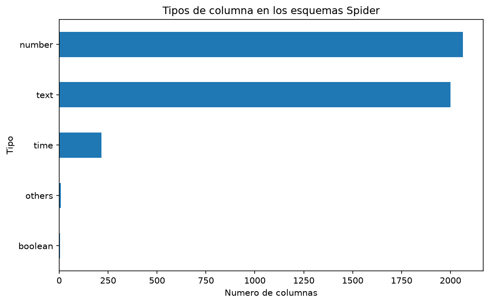

*BIRD.*

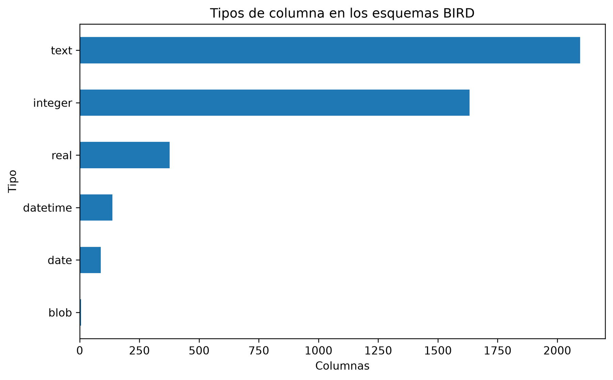

### Claves y relaciones entre tablas

Una **clave primaria (PK)** es una columna, o un conjunto de columnas, que identifica cada registro de una tabla. Una **clave foránea (FK)** indica que una columna hace referencia a una columna de otra tabla o de la misma tabla. Por ejemplo, `cliente_id` en una tabla de pedidos puede hacer referencia a `id` en una tabla de clientes. Esta relación permite asociar cada pedido con su cliente y combinar la información mediante `JOIN`. Una clave primaria puede existir aunque ninguna otra tabla la referencie.

Para describir estas conexiones, se consideran tres medidas por base de datos:

- **Número de relaciones FK:** cantidad de vínculos entre columnas declarados en el esquema. Dos tablas pueden tener varios vínculos entre sí.
- **Porcentaje de tablas que participan en FK:** número de tablas que tienen al menos una columna de origen o destino de una FK, dividido entre el total de tablas y multiplicado por 100. Cada tabla se cuenta una sola vez.
- **Porcentaje de columnas que son PK o participan en FK:** número de columnas que forman parte de una clave primaria o de cualquiera de los dos extremos de una clave foránea, dividido entre el total de columnas y multiplicado por 100. Cada columna se cuenta una sola vez, aunque cumpla varias funciones.

Por ejemplo, si una base tiene 10 columnas y 4 de ellas son PK o participan en FK, este último porcentaje es del 40 %. Las medidas indican cuántas tablas y columnas intervienen en las claves del esquema. El porcentaje de columnas incluye también las claves primarias que no tienen vínculos con otras tablas, por lo que no mide la fuerza de una dependencia entre tablas.

La mediana del número de relaciones FK por base es 3 en Spider y 4 en BIRD. El máximo es 25 en Spider, alcanzado por `hospital_1` y `cre_Drama_Workshop_Groups`, y 61 en BIRD, correspondiente a `works_cycles`. La mediana del porcentaje de columnas que son PK o participan en FK es 31,18 % en Spider y 25,03 % en BIRD. Para obtener estas medianas, primero se calcula el porcentaje de cada base y después se toma el valor central de los porcentajes ordenados.

**Figura 8.** Claves y relaciones en los esquemas de Spider (arriba) y BIRD (abajo). A la izquierda, cada punto representa una base y su color indica el número de relaciones FK. A la derecha, se muestra la distribución del porcentaje de columnas que son PK o participan en FK.

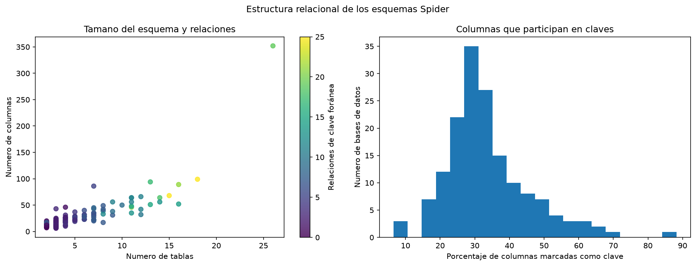

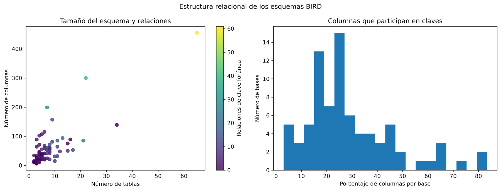

En BIRD hay 13 bases sin relaciones FK declaradas en sus esquemas. Aun así, es posible combinar sus tablas mediante SQL si existen columnas adecuadas para relacionarlas. Además, una base puede tener varios grupos de tablas relacionados por separado: que muchas tablas participen en FK no significa que todas estén conectadas entre sí. Las Figuras [8](#fig-datos-relaciones) y [9](#fig-datos-claves-bird) resumen las claves y relaciones declaradas.

**Figura 9.** Distribuciones de columnas PK, relaciones FK y porcentaje de tablas que participan en FK en BIRD.

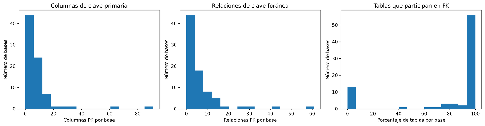

## Vocabulario de las preguntas

En Spider destacan *name* (1 766 apariciones), *names* (1 738) y *number* (1 368); en BIRD, *list* (1 878), *name* (1 522) y *number* (1 133). Estos términos reflejan solicitudes frecuentes de enumeración, identificación y conteo. La presencia en BIRD de términos como *percentage* y *calculate* también motiva examinar preguntas que requieren operaciones numéricas. Las frecuencias son descriptivas y no constituyen una clasificación exhaustiva de intenciones.

**Figura 10.** Veinticinco términos más frecuentes en las preguntas de cada conjunto.

*Spider.*

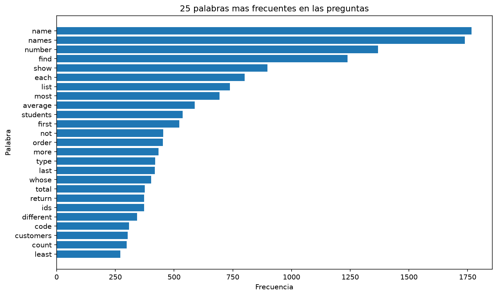

*BIRD.*

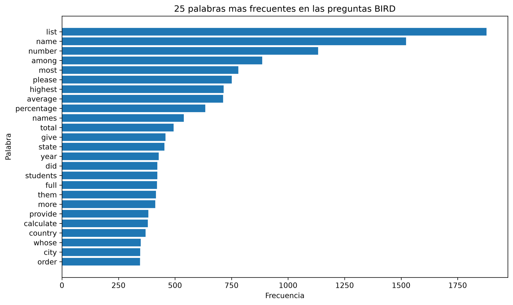

## Justificación de la selección y alcance experimental

Ambos conjuntos se corresponden directamente con el problema planteado: cada ejemplo permite utilizar una pregunta y el esquema objetivo como entrada, y una consulta SQL anotada como referencia de salida. La disponibilidad de tablas, columnas, tipos y claves permite estudiar la selección de elementos del esquema y la generación de consultas que respeten su estructura.

Spider aporta diversidad de formulaciones y construcciones SQL, además de una separación entre entrenamiento y validación sin bases compartidas. BIRD complementa ese escenario con esquemas más extensos en las estadísticas observadas, una mayor proporción de consultas con `JOIN` y evidencia auxiliar que permite estudiar el efecto del conocimiento contextual. Esta complementariedad justifica analizarlos conjuntamente, manteniendo separados sus resultados y protocolos de evaluación.

<!--
Referencias bibliográficas comentadas, como en paper_datos.txt.

- [datos:spiderpaper] T. Yu et al. (2018). *Spider: A Large-Scale Human-Labeled Dataset for Complex and Cross-Domain Semantic Parsing and Text-to-SQL Task*. Proceedings of EMNLP, pp. 3911–3921. <https://aclanthology.org/D18-1425/>.

- [datos:birdpaper] J. Li et al. (2023). *Can LLM Already Serve as A Database Interface? A BIg Bench for Large-Scale Database Grounded Text-to-SQLs*. Advances in Neural Information Processing Systems, vol. 36, Datasets and Benchmarks Track. <https://proceedings.neurips.cc/paper_files/paper/2023/hash/83fc8fab1710363050bbd1d4b8cc0021-Abstract-Datasets_and_Benchmarks.html>.

- [datos:spiderhf] XLang NLP Lab. *Spider en Hugging Face: anotaciones y licencia CC BY-SA 4.0*. <https://huggingface.co/datasets/xlangai/spider>. Consulta: 6 de octubre de 2026.

- [datos:spiderrepo] Repositorio oficial de Spider. *Formato de anotaciones y metadatos de esquema*. <https://github.com/taoyds/spider>. Consulta: 6 de octubre de 2026.

- [datos:birdmirror] Deema. *BIRD-SQL: copia comunitaria de anotaciones y esquemas*. <https://huggingface.co/datasets/Deema/BIRD-SQL/tree/main>. Consulta: 6 de octubre de 2026.

- [datos:birdrepo] Proyecto BIRD. *Documentación de datos, licencia y evaluación*. <https://github.com/AlibabaResearch/DAMO-ConvAI/tree/main/bird>. Consulta: 6 de octubre de 2026.
-->
